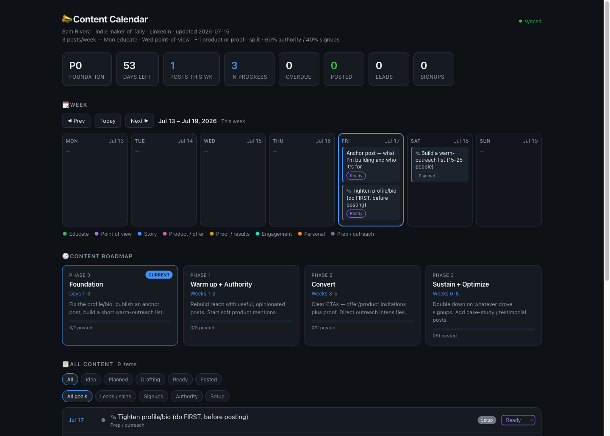
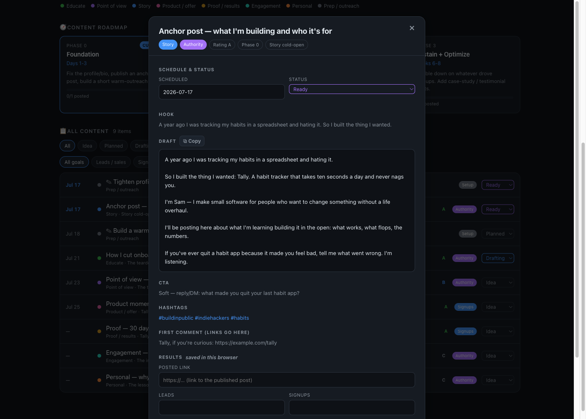

# Content Marketing Agent

Version <!-- version:start -->`v1.0.0`<!-- version:end --> · built and tested on macOS ([platform notes](#platform-support))

A local, private content-marketing operator you run with your coding agent. You talk; it plans,
drafts, schedules, and tracks your posts on a dashboard you own. No SaaS, no login, no data
leaving your machine.

## The problem

Content marketing for a small brand is mostly upkeep, and the upkeep is what kills it. Coming up
with angles, keeping them on-voice, not repeating yourself, remembering what you posted and whether
it worked, staying consistent week after week. The writing is the fun part. The *system* around the
writing is the part that quietly falls apart, and once it does, you stop posting.

That system is the job this hands off. Your agent holds the plan: it knows your brand voice, your
audience, and your goals; it proposes ideas, drafts posts in your voice, schedules them across a
calendar, and keeps a record of what shipped and what it did. Your attention goes back to the parts
only you can do — the real opinion, the final edit, and hitting publish.

## How you use it

Using it is a loop between you, your agent, and the dashboard.

![Diagram of the two-step loop. Step 1, tell your agent: say what you want — "draft a post about X," "give me content ideas," or "what should I post this week?" — and it drafts in your voice and files everything into the calendar. Step 2, review and shape the calendar: open the dashboard in your browser to see your week, your roadmap, and your idea pipeline, read and copy a draft, and — once you publish — mark it posted and log the link, leads, and signups. A repeat symbol in the middle shows that you keep running the loop as you keep posting.](docs/how-you-use-it.svg)

**1. Tell your agent what you're doing.** Open a session with your agent (Claude, Codex, whatever
you use) and talk to it like a person. "Draft a post about X." "Give me content ideas." "What
should I post this week?" It reads your brand voice and your log, drafts in your voice, and files
everything into the calendar.

**2. Review the dashboard and shape it.** Open it in your browser to see the week, the roadmap, and
every idea in the pipeline. Click any post to read its full draft, copy it, and — once you publish —
mark it posted and log the link, the leads, the signups, and how it landed. That working state saves
itself; your agent folds it back into the plan.

**Then keep the loop going.** You have a conversation and the calendar stays current, so you never
keep a content board tidy by hand.

## What it looks like

The dashboard opens with a stat strip (current phase, days left, posts this week, what's in
progress, what's overdue, what's posted, and your leads/signups tallies), a week calendar, your
content roadmap, and a filterable list of every post and idea.



Below the calendar sits your content roadmap — the phases of your current push, each showing how many
of its posts have shipped — and the full backlog. The All Content list holds every post and prep task,
filterable by status and goal, each row tagged with its pillar, priority rating, goal, and a status
dropdown you can change on the spot.


Click any post and its full context opens in a panel: pillar, goal, schedule and status, the hook,
the complete draft ready to copy, the CTA, hashtags, and a results section where you record how it
did after you publish.



## Quickstart

Open your coding agent (Claude Code, Codex, or similar), start a new session in an empty folder,
and paste this:

```
Set up the Content Marketing Agent in this folder (use a new subfolder if this one
isn't empty; your call). Download it as a zip rather than cloning, so no git
history comes attached. Fetch
https://github.com/Waterbear-AI/content-marketing-agent/archive/refs/heads/main.zip,
unpack it, and move the files into place (the zip expands into a
content-marketing-agent-main/ folder, so flatten that until the files sit directly in
the working folder), then delete the zip. Then run `npm start` to launch the local
dashboard in the background, confirm it's actually up and running, and tell me to
open http://127.0.0.1:24317/ in my browser.
```

Your agent handles setup and gives you a link. Open it and there's your dashboard — empty and ready
for your first session (the screenshots above show it populated, to give you the idea). You're left
with a plain folder and no git history, so nothing is tracked or pushed anywhere unless you decide to
set that up.

## What happens next

The first time you run it, your agent notices the workspace is still the template and asks a few
quick questions: your name and brand, what you make, who you're talking to, what your content should
actually *do* (leads, audience growth, authority), how you sound, and where and how often you post.
Answer however you'd say it out loud; a sentence each is plenty. It fills in your brand voice, your
offerings, and your roadmap, and you're into the loop above.

## A note on privacy

This project lives on GitHub as a public template, free for anyone to copy. You download it as a
plain zip instead of cloning it, so your copy keeps no link back to the public repo. Everything you
tell your agent — drafts, strategy, numbers, plans — stays in a few files inside your own folder and
syncs nowhere by default. The one thing to avoid is publishing your filled-in copy somewhere public.

Want a backup, or the same setup on two machines? Set up a private git repo of your own. It's
entirely optional, and the tool runs fine without one.

## Requirements

- **A coding agent.** Claude Code and Codex both work. Anything similar that can read and edit local
  files and run shell commands should be fine too.
- **Node.js** on your machine, to run the local dashboard server. Not sure whether you have it? Run
  the Quickstart anyway and your agent will tell you what's missing.
- **git** is optional. You only need it if you later decide to keep your own private version history
  (see the privacy note above). The tool runs fine without it.

## Platform support

This was built and tested only on macOS. Nothing here has been run on Linux or Windows yet. The
server is plain Node.js with no dependencies and the dashboard is a static HTML page, so both should
be fine cross-platform, but that's an expectation, not something that's been verified. If you run it
elsewhere, the most likely rough edge is the shell scripts (`start.sh` and `stop.sh`), which assume a
bash-like shell; on Windows you'd want WSL or Git Bash, or you can start the server directly with
`node server.js`. If you try it on another platform, a note about how it went is welcome.

## Curious how it works under the hood?

See [HOW_IT_WORKS.md](HOW_IT_WORKS.md) for the architecture, the files involved, and why it's built
the way it is.

## License

MIT. See [LICENSE](LICENSE).
